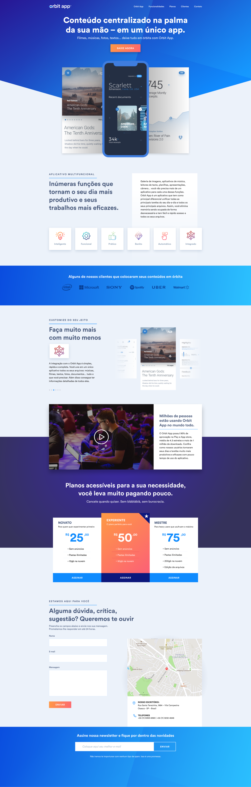
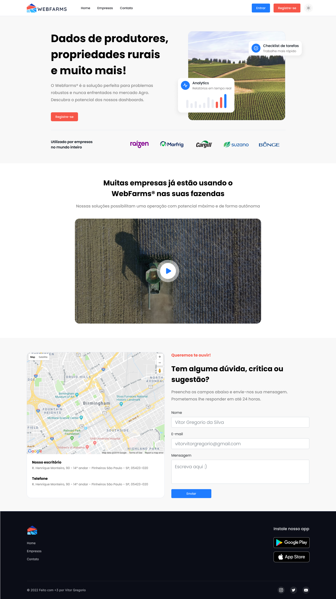

<h1 align="center"> Landing page criada como teste para vaga de estágio na empresa SciCrop</h1>
<hr>

<p align="center">
    
    
    
    
    
</p>

<h2>Tópicos </h2> 

:small_blue_diamond: [Descrição do projeto](#descrição-do-projeto)

:small_blue_diamond: [Funcionalidades](#funcionalidades)

:small_blue_diamond: [Deploy da Aplicação](#deploy-da-aplicação)


:small_blue_diamond: [Como rodar a aplicação](#como-rodar-a-aplicação-desktop_computer)

## Descrição do projeto 

<p align="justify">
  Landing page criada em HTML, CSS, Bootstrap e javascript para vaga de estágio na empresa SciCrop. No desafio proposto pediam para criar uma landing page contendo 3 sessôes (uma seção principal, uma seção de conteúdo e uma seção de contato.) utilizei como idéia criar uma landing page para o produto WebFarms
</p>

## deploy da aplicação

🌐 <a href="https://vitorvitorgregorio.github.io/SciCrop/" target="_blank"> Aqui nesse link você pode ver a aplicação online sem precisar baixar no seu computador </a> </br> <hr>
  🌐 <a href="https://www.figma.com/file/MWGG4QWpyAm278HDvOKFAi/SciCrop?node-id=0%3A1" target="_blank"> Neste link você consegue ver o projeto no FIGMA </a>
  <div align="center">
    <h3> Landing page de exemplo proposta pela empresa 🔽 </h3>
    
    <h2> Minha solução para o desafio 🔽 </h2>
     </br>
    
    <h3> gostei de realizar esse desafio e propor uma landing page para o WebFarms </h3>
  </div>

## Funcionalidades

:heavy_check_mark: mobile first

## Como rodar a aplicação :desktop_computer:

No terminal, clone o projeto: 

```
git clone https://github.com/vitorvitorgregorio/SciCrop
```
 
Acesse o documento index.html e pronto, você terá o projeto rodando localmente no seu navevgador :)

## Linguagens, dependencias e libs utilizadas :books:

- [Javascript](https://developer.mozilla.org/pt-BR/docs/Web/JavaScript)
- [HTML](https://developer.mozilla.org/pt-BR/docs/Web/HTML)
- [CSS](https://developer.mozilla.org/pt-BR/docs/Web/CSS)
- [BOOTSTRAP](https://getbootstrap.com)
